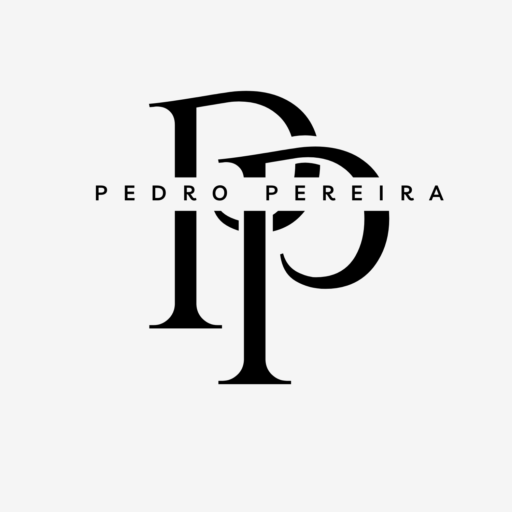

# Pedro Pereira Portfolio

> It is as bad as you think it is!

## Introduction

Hi, im a programing student in the [`Polytechnic university of leiria`](https://www.ipleiria.pt/en/) im curently in the [`PSI`](https://www.ipleiria.pt/en/course/tesp-information-systems-programming/) *Professional Higher Technical Course* (TeSP). 

You stumbled upon my [GitHub](https://github.com/MrMagmaPT) page, and found this atrocity, this is basically my portfolio website where i will be placing all my projects, either completed or works in progress. 

This "Hub" will work as a simple yet efficient way for people to check my work, some of it will be good, some will be absolute garbage, thats how life goes, it cant all be master works.

All my projects fall under the [MIT](https://github.com/MrMagmaPT/Cacorrafiofobia/blob/main/LICENSE) lincense unless stated otherwise.

Apart from that, if you are looking at this you are either curious to know more about me, or just los:
1. If you are lost do the following
   * For entry level users, to go back to **_Google_** click on this link :arrow_right: [www.google.com](https://www.google.com/)
   * For more advanced users, to go back to **_YouTube_** click on this link :arrow_right: [www.youtube.com](https://www.youtube.com/)
   * For absolute Experts to go back to **_ChatGPT_** click on this link :arrow_right: [chatgpt.com](https://chatgpt.com/)
   * For Extremly professional ultra 4k Gamers,here is the link to **_Steam_** :arrow_right: [store.steampowered.com/](https://store.steampowered.com/)